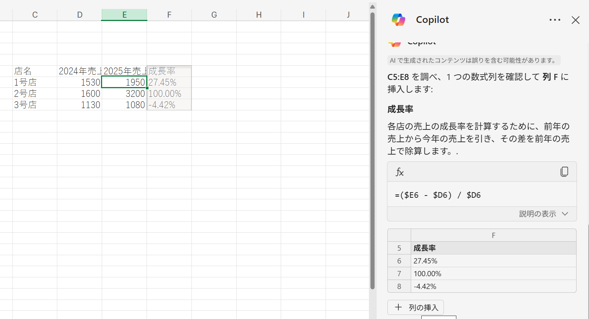

# Excel: 数式を設定した列の追加

- Excelに移動
- 「空白のブックを作成」をクリック
- 以下の表データをコピーしてシートに貼り付け
- 画面上部のメニュー内のCopilotアイコンをクリックしてチャットを表示
- プロンプト「成長率の列を追加」と入力
- 「＋列の挿入」をクリック
- 「成長率」列が追加される

表データ(タブ区切り):
```
店名	2024年売上	2025年売上
1号店	1530	1950
2号店	1600	3200
3号店	1130	1080
```

結果例

