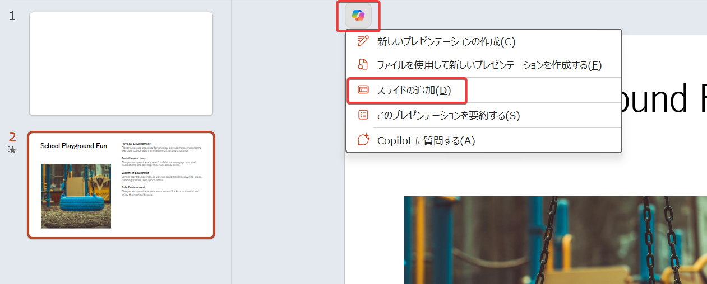

# PowerPoint: プレゼンテーションへの新しいスライドの追加

## 注意

2025/4/19 スライドの作成はWeb版のPowerPointでは失敗する場合がある。

なおWeb版でも、Copilotを使用してプレゼンテーションの新規作成をする際、プロンプトを投入してスライド案を生成したあと、「＋」をクリックして「トピック」を追加することはできる。

## スライドの追加

- 画面上部のメニューのCopilotアイコンをクリック
- 「お寿司の健康面のメリットを説明するスライドを追加してください」と入力
- 新しいスライドが追加される。

<!--
以下の2つのプロンプトを順に投入する。

- Can you help me brainstorm an icebreaker question that would be good for a global audience? Provide three options for me to choose from.
- Use question 1 as the icebreaker, and generate a slide that includes a complementary image. Insert this slide as the first slide in the presentation.

参考和訳:

- 世界中の聴衆に適した、ブレインストーミングのためのアイスブレイクの質問を作成していただけますか？3つのオプションを提示してください。
- 質問1をアイスブレイクとして使い、スライドを作成してください。このスライドをプレゼンテーションの最初のスライドとして挿入してください。
-->

## デスクトップ版でのスライドの追加

